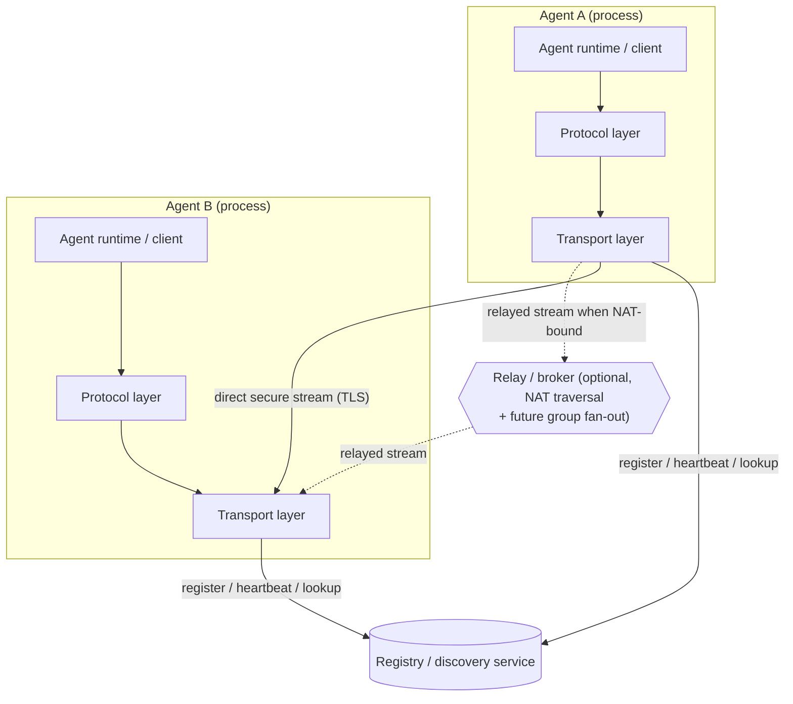
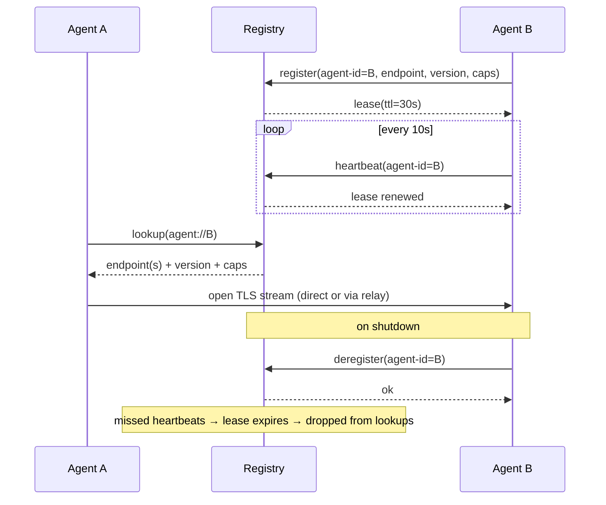

# Agent Communication Architecture

This document is the **Phase 2 (Design)** deliverable of the
agent-communication-system epic. It defines a single, opinionated,
decision-complete architecture for agent-to-agent communication across
servers, containers, and the public internet. Phases 4–6 (message protocol,
network transport, SDK/examples) build directly against the decisions captured
here.

It is intentionally **self-contained**: no separate phase-1 research artifact
exists in-repo at the time of writing, so the comparative rationale is embedded
inline. If a research-findings document lands later it can be cross-linked from
the relevant sections — this design does not block on it.

The fleet bias established in
[ADR 0001](decisions/0001-programming-language.md) is **stdlib-first /
minimal-dependency**: every technology recommendation below weighs
dependency and operational weight against that principle and justifies any
deviation explicitly.

## Overview & goals

The system provides **point-to-point communication between autonomous agents**
that may run on different hosts, inside different containers, behind NAT, or
across the public internet. An agent is a long-lived process that can both
**initiate** messages to a peer and **serve** messages from peers. The design
optimises for a small, dependency-light core that an autonomous coder can
implement incrementally.

**Goals**

- A versioned, transport-independent **message envelope** that all agents share.
- A concrete **network transport** that works across servers, containers, and
  the internet, with transport-level security.
- **Registration & discovery** so an agent can announce itself and locate peers
  by stable logical identity rather than by ephemeral IP.
- First-class **request/response correlation**, plus fire-and-forget events.
- A defined **error taxonomy** and recovery behaviour for every failure mode.
- **Design-for-extension** seams so future *agent group* communication
  (broadcast, group subscriptions, fan-out) is addable without redesign.

**Non-goals (this epic / explicitly deferred)**

- Implementing agent **group / broadcast** delivery now. The envelope and
  transport boundary reserve seams for it (see §7), but no group fan-out is
  built in Phases 4–6.
- A general-purpose message **bus / queue** with durable storage,
  at-least-once delivery guarantees, or replay. Delivery is best-effort with
  application-level retry.
- **Workflow orchestration**, scheduling, or agent lifecycle management — those
  belong to the runtime that embeds this layer, not to the communication layer.
- Integration with this repo's mail/auto-mail subsystem. `robotsix-auto-mail`
  is only the **tracking/host board** for the epic's design docs; no email code
  is touched.

**Assumptions the design rests on**

- Agents have a stable **logical identity** (an `agent-id`) that outlives any
  single network address.
- Each agent can either accept inbound TCP connections **or** maintain an
  outbound connection to a relay; the design supports both so NAT-bound agents
  are first-class.
- Clocks are loosely synchronised (used only for timeouts/heartbeat, never for
  ordering or correctness).
- A modest, trusted-ish deployment scale initially (tens of agents), with an
  addressing/discovery model that does not preclude growth.

> **Forward-looking note.** The design *anticipates* agent-group communication
> (broadcast and group subscriptions) but does **not** implement it now. §7
> shows exactly which envelope fields and which transport seam make it an
> additive change later.

## System components & responsibilities

The system decomposes into a thin, layered stack. Each agent embeds the same
**client/runtime + protocol + transport** layers; the **registry** and the
optional **relay/broker** are shared infrastructure.

| Component | Responsibility |
|---|---|
| **Agent runtime / client** | Embeds the stack in an agent process. Exposes `send_request`/`on_request`/`emit_event` style APIs, owns correlation state, applies timeouts and retries. |
| **Message protocol layer** | Defines and (de)serialises the envelope; validates required fields; enforces version negotiation; routes inbound messages to handlers by `kind` and `correlation-id`. |
| **Transport layer** | Moves serialised envelopes between peers over a secure stream. Owns connection establishment, framing, keep-alive, TLS, and the **subscription/fan-out seam** (§7). |
| **Registry / discovery service** | Authoritative directory mapping `agent-id` → current reachable endpoint(s), capabilities, and liveness. Handles register, renew (heartbeat), lookup, and deregister. |
| **Relay / broker (optional)** | For peers that cannot accept inbound connections (NAT/firewall), relays frames between two outbound connections. The same component is the **future home of group fan-out** (§7). Optional and pluggable — direct connections never require it. |



The layering mirrors this repo's own structural convention (see
[architecture.md](architecture.md)): a shared base contract at the bottom
(transport), protocol-specific behaviour above it, and surfaces on top.

## Message format / protocol specification

All communication is a single **envelope** carrying a typed `payload`. The
envelope is transport-independent: the same structure is used over a direct
connection or a relay.

### Serialization choice

**Chosen: JSON (UTF-8), newline-delimited on the wire (one envelope per frame).**

| Option | Dependency weight | Pros | Cons |
|---|---|---|---|
| **JSON (`json` stdlib)** | **Zero** — stdlib | Human-readable, debuggable, ubiquitous, schema-flexible for additive evolution | Larger than binary; no built-in schema enforcement |
| MessagePack | Third-party (`msgpack`) | Compact binary | New dependency; opaque on the wire; marginal gain at this scale |
| Protobuf / gRPC | Heavy third-party + codegen toolchain | Strong typing, streaming | Codegen build step, large operational surface — squarely against stdlib-first |
| Pickle | Stdlib | Trivial for Python | **Unsafe** across trust boundaries (arbitrary code execution); cross-language hostile |

**Why JSON over the alternatives.** Per the stdlib-first principle of
[ADR 0001](decisions/0001-programming-language.md), JSON is handled entirely by
the `json` standard-library module — **zero new dependencies**. It is
human-readable (critical for debugging a distributed system), evolves
additively (unknown fields are ignored, enabling forward compatibility), and is
language-neutral for future non-Python agents. Binary formats (MessagePack,
Protobuf) buy compactness we do not need at the target scale while adding a
dependency and operational weight; Pickle is rejected outright as an
unauthenticated-input deserialization hazard. The framing is **length-prefixed
or newline-delimited JSON** so a stream reader can recover envelope boundaries
without parsing the whole stream.

### Message kinds

| `kind` | Direction | Correlated? | Purpose |
|---|---|---|---|
| `request` | initiator → peer | yes (`correlation-id` set) | Asks a peer to do work and reply. |
| `response` | peer → initiator | yes (echoes `correlation-id`) | Successful reply to a `request`. |
| `error` | peer → initiator | yes (echoes `correlation-id`) | Failure reply; carries the standard error shape (§8). |
| `event` | initiator → peer | no | Fire-and-forget notification; no reply expected. |
| `broadcast` *(reserved)* | initiator → group | optional | **Reserved shape** for future group/fan-out delivery (§7). Defined now, not delivered now. |

### Versioning strategy

The envelope carries an explicit `protocol-version` (`MAJOR.MINOR`). **Minor**
bumps are additive and backward-compatible (new optional fields, new
non-essential `kind`s); a receiver ignores unknown optional fields and unknown
non-request kinds. **Major** bumps are breaking. On connect, peers exchange
their highest supported `protocol-version`; if **major** versions are
incompatible the connection is refused with a `version-mismatch` error (§8).
This lets Phases 4–6 evolve the schema without a flag-day upgrade.

### Envelope schema example

```json
{
  "protocol-version": "1.0",
  "message-id": "01J9Z6Q9F3K8X2P7M4N5R6S7T8",
  "correlation-id": "01J9Z6Q9F3K8X2P7M4N5R6S7T8",
  "kind": "request",
  "from": "agent://billing-worker-3",
  "to": "agent://ledger-service",
  "group": null,
  "created-at": "2026-06-14T10:15:30Z",
  "ttl-ms": 30000,
  "content-type": "application/json",
  "payload": {
    "method": "reserve_funds",
    "args": { "account": "A-42", "amount_cents": 1500 }
  },
  "auth": { "scheme": "bearer", "token": "<jwt-or-opaque-token>" }
}
```

### Field table

| Field | Type | Required | Description |
|---|---|---|---|
| `protocol-version` | string `MAJOR.MINOR` | yes | Envelope/protocol version for negotiation. |
| `message-id` | string (ULID/UUID) | yes | Globally unique id for this message; basis for idempotency/dedup. |
| `correlation-id` | string | conditional | Ties a `response`/`error` to its `request`. Set on `request` (often equal to `message-id`), echoed on the reply. Absent/`null` for `event`. |
| `kind` | enum | yes | One of `request`, `response`, `error`, `event`, `broadcast` (reserved). |
| `from` | string (`agent://<agent-id>`) | yes | Sender's logical identity. |
| `to` | string (`agent://<agent-id>`) | conditional | Recipient's logical identity for point-to-point messages. Mutually exclusive with `group`. |
| `group` | string (`group://<group-id>`) or null | no | **Reserved** group address for future fan-out (§7). `null` today. |
| `created-at` | string (RFC 3339 UTC) | yes | Send timestamp; used for timeout/heartbeat reasoning only. |
| `ttl-ms` | integer | no | Sender's expiry hint; a receiver may drop an expired message. |
| `content-type` | string | yes | Payload media type (default `application/json`). Enables future alternate encodings without an envelope change. |
| `payload` | object | yes | Kind-specific body (method+args for `request`, result for `response`, error object for `error`, event body for `event`). |
| `auth` | object or null | no | Message-level auth material (§9); may be omitted when transport-level mTLS suffices. |

## Network communication strategy

### Transport choice

**Chosen: persistent TCP streams secured with TLS, carrying length-framed JSON
envelopes.** Connections are **direct peer-to-peer by default**, falling back
to a **relayed** connection only when a peer cannot accept inbound connections.

| Transport option | Dependency weight | Fit | Notes |
|---|---|---|---|
| **TCP + TLS (`socket` + `ssl` stdlib)** | **Zero** — stdlib | **Chosen** | Full control of framing, keep-alive, and the fan-out seam; bidirectional; works for both direct and relayed models. |
| HTTP/1.1 request-response (`http.server`/`http.client`) | Stdlib | Partial | Natural for request/response, but awkward for server-initiated `event`s and long-lived bidirectional streams without long-polling/SSE hacks. |
| WebSocket | Third-party (`websockets`) or hand-rolled | Good | Bidirectional and firewall-friendly, but the stdlib has no production WS server — adds a dependency against ADR 0001. Kept as a documented future option behind the transport seam. |
| gRPC / HTTP/2 | Heavy third-party + codegen | Good but heavy | Strong streaming story, but large operational/dependency surface — rejected on stdlib-first grounds. |
| Raw UDP / QUIC | Stdlib UDP / third-party QUIC | Poor/heavy | UDP gives no delivery/ordering; QUIC needs a third-party stack. Not justified at target scale. |

**Why not the alternatives?** HTTP/1.1 cannot cleanly carry server-initiated
events over one long-lived connection without SSE/long-poll workarounds.
WebSocket and gRPC both solve the bidirectional problem but each **introduces a
runtime dependency**, which ADR 0001 tells us to avoid unless the core data
path demands it — and here `socket` + `ssl` from the standard library already
covers the path end-to-end. TCP+TLS therefore wins on the stdlib-first
principle while leaving WebSocket reachable later through the transport
abstraction (§7) if browser/proxy reach becomes a requirement.

### Connection model

- **Direct:** the initiator looks up the peer's endpoint in the registry, opens
  a TLS stream, and reuses it for subsequent messages (connection pooling per
  `agent-id`).
- **Relayed:** when the target is NAT-bound, both peers hold **outbound** TLS
  connections to a shared **relay**; the relay splices frames between them by
  `agent-id`. No inbound port is required at either agent.

### Addressing scheme

Logical addresses use a URI form: `agent://<agent-id>` for peers and the
reserved `group://<group-id>` for future groups. The registry resolves a
logical `agent-id` to one or more **physical endpoints**
(`tls://host:port` or `relay://<relay-id>/<agent-id>`). Application code only
ever references the stable logical id; physical endpoints may change freely.

### NAT / firewall traversal

Direct connections work whenever the target can accept inbound TCP. Otherwise
the **relay fallback** above provides traversal using only **outbound**
connections (the common case that firewalls permit). This keeps the common
deployment — agents in containers behind NAT — first-class without requiring
hole-punching or per-site firewall changes.

### Transport security

All streams are **TLS 1.2+** (prefer 1.3) via the stdlib `ssl` module.
**Mutual TLS (mTLS)** is the default authentication of peers (§9): each agent
presents a certificate whose subject binds to its `agent-id`. The relay
terminates the transport hop but envelopes carry optional message-level `auth`
for **end-to-end** verification across a relay where mTLS cannot be end-to-end.

## Agent registration & discovery

**Chosen model: a lightweight central registry service** (register / heartbeat
/ lookup / deregister), rather than gossip or purely static config.

| Discovery model | Pros | Cons | Verdict |
|---|---|---|---|
| **Central registry** | Simple, authoritative, easy liveness, trivial to implement with stdlib | Single logical point to operate (mitigable with replication) | **Chosen** — best fit for target scale & stdlib-first. |
| Gossip / DHT | No central component, scales large | Complex, eventual consistency, heavy to implement correctly | Over-engineered for tens of agents. |
| Static config | Zero infra | No liveness, manual churn, brittle | Acceptable only as a bootstrap fallback (locating the registry itself). |

**Identity & addressing.** An agent registers its stable `agent-id`, one or
more physical endpoints, its `protocol-version`, and declared capabilities. The
registry is the authority for `agent-id` → endpoint resolution.

**Liveness / heartbeat.** Registration is a **lease**: the agent renews via a
periodic heartbeat (e.g. every 10 s) with a TTL (e.g. 30 s). Missing
heartbeats expire the lease and the agent is dropped from lookups
(registry-side liveness without polling agents).

**Deregistration.** On graceful shutdown an agent sends an explicit deregister;
ungraceful exits are handled by lease expiry. Lookups never return an expired
entry.



## Request–response & messaging patterns

**Correlation.** A `request` sets `correlation-id` (commonly equal to its
`message-id`). The peer's `response` or `error` echoes that `correlation-id`.
The initiator's runtime keeps a pending-request table keyed by
`correlation-id`, resolving the waiting caller when the reply arrives.

**Interaction patterns.**

- **Synchronous request/response** — caller awaits a correlated `response`/`error`.
- **Fire-and-forget** — an `event` with no `correlation-id`; no reply expected.
- **Streaming (future-friendly)** — multiple `response` frames may share one
  `correlation-id` with a terminal marker in the payload; the envelope already
  permits this without change. Not required for Phase 4 but unblocked by the
  design.

**Timeouts.** Each `request` carries a `ttl-ms` hint and the initiator arms a
local deadline. On expiry the pending entry is failed with a `timeout` error
(§8) and any late reply is discarded.

**Retries & idempotency.** Retries are an **application-level** decision (the
core is best-effort). Because every message has a unique `message-id`, a
receiver can **dedupe** retried requests; `request` handlers SHOULD be
idempotent (or guard with `message-id`) so a retried request is safe. `event`
delivery is at-most-once; consumers that need stronger guarantees layer their
own acknowledgement on top.

```mermaid
sequenceDiagram
    participant A as Agent A (initiator)
    participant B as Agent B (responder)
    A->>B: request {correlation-id: C1, payload: reserve_funds}
    Note over A: arm timeout (ttl-ms)
    alt success
        B-->>A: response {correlation-id: C1, payload: result}
        Note over A: match C1 → resolve caller
    else handler failure
        B-->>A: error {correlation-id: C1, code: ...}
        Note over A: match C1 → fail caller
    else no reply before deadline
        Note over A: timeout → fail caller; discard any late C1
    end
```

## Architectural support for future agent group communication

Group communication (broadcast and group subscriptions) is **not implemented**
in this epic, but the design exposes concrete seams so it is an **additive**
change rather than a redesign.

1. **Envelope group address (already defined).** The envelope reserves the
   `group` field (`group://<group-id>`) and the `broadcast` `kind`. A
   group-addressed message sets `group` and leaves `to` empty; today both are
   `null`/absent and only point-to-point is delivered. Adding group delivery
   does **not** change the envelope schema — the fields already exist, so
   existing agents remain wire-compatible (they ignore the unknown
   non-request kind per the §3 versioning rules).

2. **Transport-layer subscription / fan-out seam.** The transport layer exposes
   a single delivery boundary — conceptually `deliver(envelope, resolve_targets)`
   — where `resolve_targets` returns one endpoint for point-to-point today. A
   future **subscription registry** (group-id → member `agent-id`s) plugs into
   this same boundary so one `broadcast` envelope fans out to N members. No
   change to the protocol or runtime APIs above the seam.

3. **Where a future broker plugs in.** The optional **relay/broker** is the
   designated home for group fan-out: agents subscribe to a `group://` at the
   broker, and the broker replicates a `broadcast` envelope to all current
   subscribers using the existing relayed-stream mechanism. The registry gains
   a parallel group-membership table mirroring its agent-lease model.

In short: **envelope (`group` field + `broadcast` kind)** plus **the transport
`resolve_targets` seam** are the two load-bearing extension points; everything
else (groups membership, broker fan-out) layers on without touching Phase 4–6
contracts.

## Error handling & failure scenarios

All failures surface as the standard **`error` envelope** (`kind: "error"`)
whose payload is the error object below, echoing the failed request's
`correlation-id` when one exists. This ties directly back to §3.

```json
{
  "code": "peer-unreachable",
  "message": "no route to agent://ledger-service",
  "retryable": true,
  "details": { "agent-id": "ledger-service" }
}
```

| Failure | Detection | Defined behaviour / recovery |
|---|---|---|
| **Peer unreachable** | connect/lookup fails or stream drops | `error{code: peer-unreachable, retryable: true}`; caller may re-lookup (endpoint may have changed) and retry with backoff. |
| **Timeout** | local deadline (`ttl-ms`) elapses with no reply | `error{code: timeout, retryable: true}`; pending entry failed, late reply discarded; caller decides on retry (idempotency via `message-id`). |
| **Malformed message** | envelope fails validation / JSON parse | `error{code: malformed-message, retryable: false}`; offending frame dropped; connection kept (one bad frame must not kill the stream). |
| **Version mismatch** | incompatible **major** `protocol-version` at handshake | `error{code: version-mismatch, retryable: false}`; connection refused; operator must align versions. |
| **Auth failure** | mTLS handshake fails or message `auth` rejected | `error{code: auth-failure, retryable: false}`; connection/message refused; no payload processed. |
| **Registry unavailable** | lookup/heartbeat to registry fails | lookups fall back to a **cached** last-known endpoint and retry the registry with backoff; heartbeats retry — registry outage does **not** tear down healthy existing streams. |

**Principle:** a single bad message degrades that message, not the connection;
a single failed connection degrades that peer, not the agent. `retryable`
in the error object tells the caller whether a retry can possibly succeed.

## Security & authentication

- **Agent identity.** Every agent has a stable `agent-id` bound to an X.509
  certificate (the certificate subject/SAN encodes the `agent-id`). The
  registry records the identity used at registration.
- **Peer authentication.** **Mutual TLS** is the default: both ends verify the
  other's certificate against a trusted CA, so an `agent://` address cannot be
  spoofed on a direct connection. Across a **relay** (which terminates the
  transport hop), end-to-end authenticity is preserved by the optional
  **message-level `auth`** field (signed token / bearer), so the relay is
  trusted to forward but not impersonate.
- **Integrity & confidentiality.** Transport-level TLS provides both on each
  hop. For relayed paths where one TLS hop is not end-to-end, message-level
  integrity (signature in `auth`) protects against a compromised relay.
- **Authorization model.** Authentication establishes *who*; authorization is a
  capability check at the handler: the receiving agent decides whether the
  authenticated `from` identity may invoke the requested `payload.method`.
  Capabilities declared at registration inform, but do not replace, the
  receiver's local check.
- **Key / credential management.** Certificates and any bearer tokens are
  provisioned out-of-band (operator/secret store), never embedded in the
  envelope schema beyond the `auth` carrier. Rotation is supported by the
  lease/heartbeat model (a re-registered agent can present a renewed
  certificate) and by short-lived message tokens. No secret is ever logged.

## Key decisions & rationale

The load-bearing decisions are consolidated below. Decisions marked
**(ADR-worthy)** are significant enough to be promoted into a standalone ADR
under `docs/decisions/` in a **future** ticket — this design does **not** create
those ADRs.

| Decision | Chosen option | Alternatives considered | Why |
|---|---|---|---|
| **Serialization** *(ADR-worthy)* | JSON (UTF-8), framed | MessagePack, Protobuf/gRPC, Pickle | Zero-dependency (`json` stdlib) per ADR 0001; human-readable, additively evolvable, language-neutral. Binary formats add a dependency for compactness we don't need; Pickle is unsafe across trust boundaries. |
| **Transport** *(ADR-worthy)* | TCP + TLS, length-framed JSON, direct-with-relay-fallback | HTTP/1.1, WebSocket, gRPC/HTTP2, UDP/QUIC | `socket`+`ssl` cover the full bidirectional path from stdlib (ADR 0001); HTTP can't cleanly carry server-initiated events; WebSocket/gRPC each add a runtime dependency; UDP/QUIC unjustified at scale. WebSocket stays reachable via the transport seam. |
| **Discovery model** *(ADR-worthy)* | Central registry with lease/heartbeat | Gossip/DHT, static config | Simple, authoritative, stdlib-implementable; gossip is over-engineered for tens of agents; static config lacks liveness (kept only as a bootstrap fallback). |
| **Security model** *(ADR-worthy)* | mTLS for peer auth + optional message-level `auth` for relayed E2E | TLS-only (no client cert), app-only tokens, no auth | mTLS prevents `agent-id` spoofing on direct links; message-level `auth` preserves authenticity across a relay that terminates TLS. |
| **Versioning** | `MAJOR.MINOR` in envelope; additive minor, negotiated major | Single version, header-only, no versioning | Lets Phases 4–6 evolve the schema without a flag-day; receivers ignore unknown optional fields/kinds. |
| **Group communication** | Reserved seams only (`group` field, `broadcast` kind, transport `resolve_targets`) | Build groups now; ignore entirely | Honours epic intent (hooks for future groups) without scope creep; additive, wire-compatible later. |

> When these decisions are promoted to ADRs, follow the established
> Context / Decision / Rationale / Consequences format of
> [ADR 0001](decisions/0001-programming-language.md), including the explicit
> "Why not X?" comparison sections used above.
